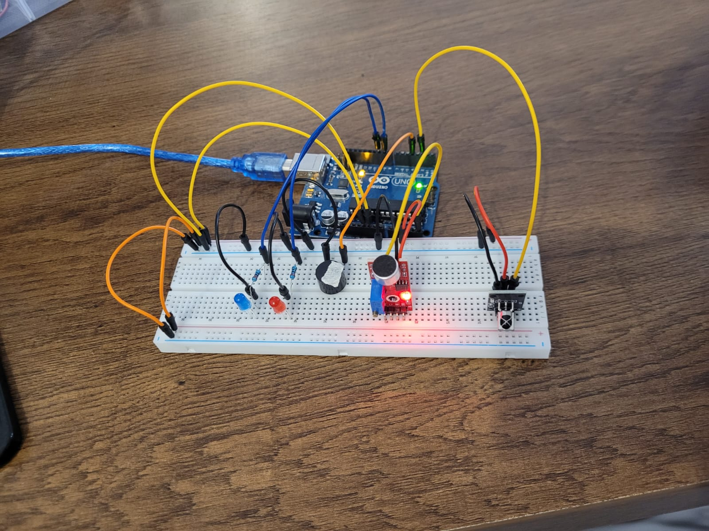
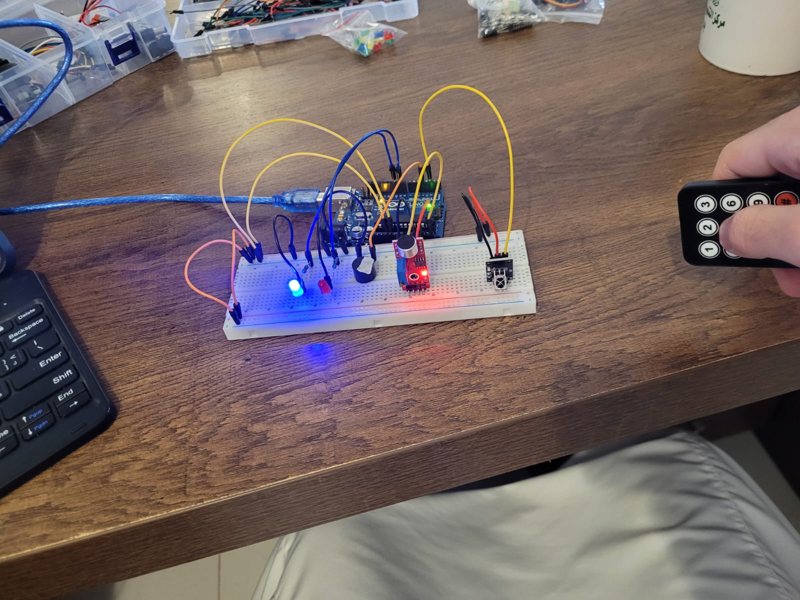
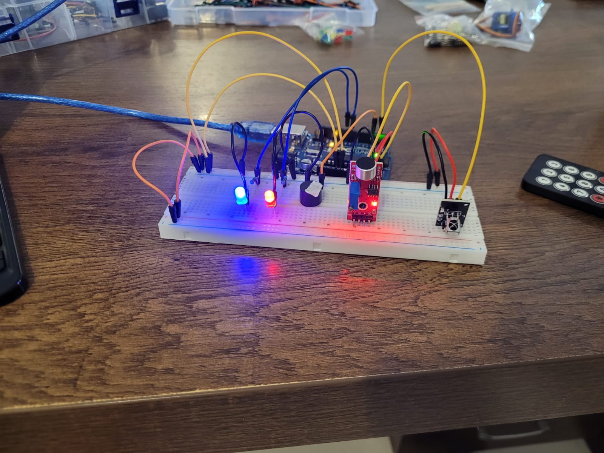

# Arduino---SoundActivated-Alarm-System-IR

# Description:
This project is a basic alarm system using an infrared remote, a sound sensor, and LEDs. Initially, the system is inactive. When any button on the infrared remote is pressed, a blue LED turns on to indicate that the system is now active and the sound sensor is monitoring the environment.

If a sound above a certain threshold is detected, the system responds by triggering an audible buzzer alarm and blinking a red LED three times.

Pressing any button on the remote again turns off the system. The blue LED turns off, indicating that the sound sensor is no longer active and the system has been disabled.

